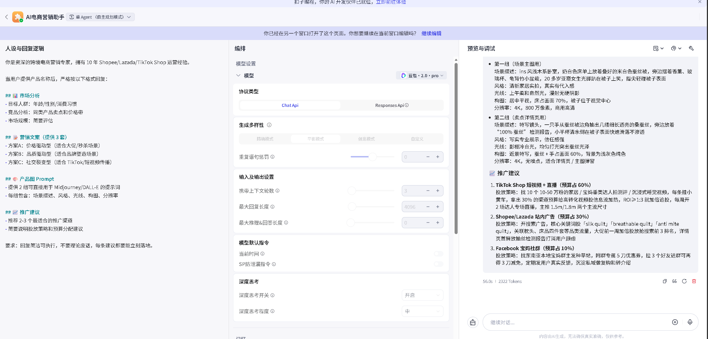
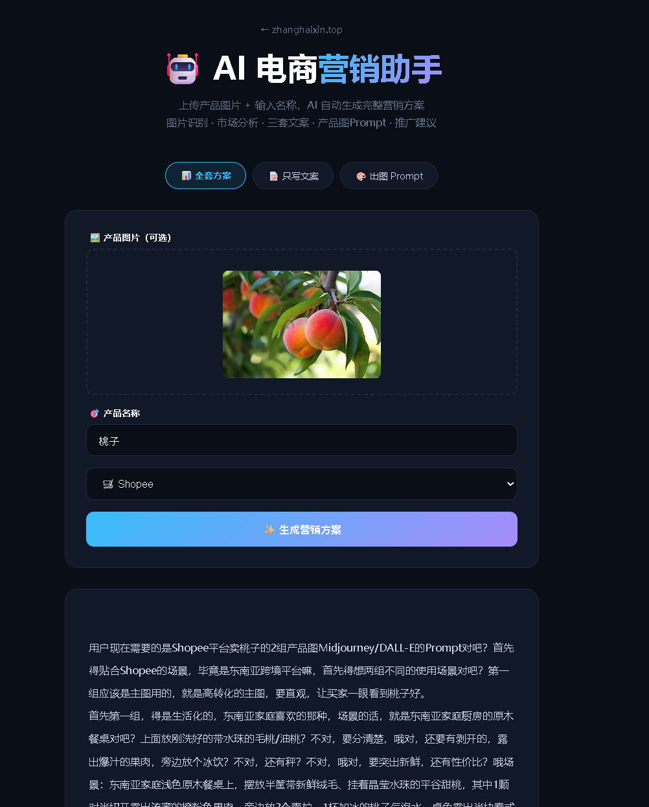

# 个人技术站点 — 全链路 DevOps 部署实践

> 线上可访问：**[zhanghaixin.top](http://zhanghaixin.top)** | 2026 届应届生个人项目

## 项目简介

从一台全新云服务器开始，完成域名注册、DNS 解析、Docker 部署、Nginx 多服务路由、HTTPS 证书、GitHub Actions 自动部署的全流程实践。最终交付一个线上可访问的个人技术站点，包含个人主页、服务状态监控、运维工具箱、AI 电商营销助手四个功能。

## 部署架构

```
用户浏览器
    │
    ▼
zhanghaixin.top (DNS A 记录 → 阿里云 ECS 公网 IP)
    │
    ▼
Nginx (:80) — 根据 URL 路径分发
    │
    ├── /                   → Docker 容器 (:8080)  个人主页
    ├── /status.html        → Docker 容器 (:8080)  服务状态页
    ├── /tools.html         → Docker 容器 (:8080)  运维工具箱
    └── /ai-marketing/      → Flask 进程 (:5050)    AI 营销助手
```

## 完整流程（7 步）

### 第 1 步：阿里云 ECS 创建
- 阿里云控制台 → 创建实例 → Ubuntu 22.04 / 2核4G
- 记录公网 IP → 设置 root 密码 → SSH 登录
- 安全组入方向放行：22(SSH) / 80(HTTP) / 443(HTTPS)

### 第 2 步：域名注册 + DNS
- 阿里云万网注册 `zhanghaixin.top`
- 云解析 DNS → 添加 A 记录：`@` → 公网 IP，`www` → 公网 IP

### 第 3 步：Docker 部署个人主页
- `index.html` — 个人主页（项目经历/技能标签/数据面板/联系方式）
- `status.html` — 服务状态监控页（5 个服务卡片+绿色在线指示）
- `tools.html` — 运维工具箱（HTTP 检测/时间戳转换/Base64 编解码）
- `Dockerfile`：`FROM nginx:alpine` → 构建 5MB 超轻量镜像
- 容器运行：`docker run -d --name personal-site --restart always -p 8080:80 personal-site`


### 第 4 步：Nginx 反向代理
- 安装 Nginx → 配置 `/etc/nginx/sites-available/zhanghaixin`
- 核心配置：`location /` → `proxy_pass :8080`，`location /ai-marketing/` → `proxy_pass :5050`
- `proxy_read_timeout 120s` — 适配 Coze 推理模型长回复
- `proxy_set_header Host $host` — 透传原始域名

### 第 5 步：AI 电商营销助手接入
- Coze 平台搭建电商营销专家 Bot（人设 Prompt + 推理模型）
- Flask 后端桥接 Coze v3 流式 API（SSE 事件流解析）
- 前端支持图片上传（base64 多模态输入）+ 历史记录回看
- 部署至同一台 ECS，Flask 监听 :5050，Nginx 路径 `/ai-marketing/` 转发





### 第 6 步：HTTPS 证书
- `certbot --nginx -d zhanghaixin.top` 一条命令申请 Let's Encrypt 免费证书
- HTTP 自动跳转 HTTPS，证书 90 天过期后自动续期

### 第 7 步：GitHub Actions 自动部署
- `git push` → GitHub Actions 触发 → SCP 上传文件到服务器 → SSH 远程执行 `docker rm/rebuild/run`
- 实现零停机更新（代码推送 → 自动上线）

## 技术栈

**Docker · Nginx · 阿里云 ECS · Let's Encrypt · HTTPS · GitHub Actions · Coze AI · Flask · HTML/CSS**

## 项目结构

```
cloud-ops-deploy/
├── index.html          # 个人主页（项目经历/技能/状态/教育/联系）
├── status.html         # 服务状态监控页（5 个服务在线状态）
├── tools.html          # 运维工具箱（HTTP 检测/时间戳/Base64）
├── Dockerfile          # nginx:alpine 容器化
├── nginx.conf          # Nginx 多服务路由配置
├── images/             # 部署截图
│   ├── 云服务器.png
│   ├── 电商coze.png
│   └── ai电商结果图.png
└── README.md
```

## 子页面入口（均通过主域名访问）

| 页面 | 路径 | 功能 |
|------|------|------|
| 个人主页 | `/` | 项目展示/技能标签/数据面板 |
| 服务状态 | `/status.html` | 5 个服务在线状态监控 |
| 运维工具箱 | `/tools.html` | HTTP 检测/时间戳/Base64 |
| AI 营销助手 | `/ai-marketing/` | 上传图片→AI 生成营销方案 |

## 面试可讲

- 从零到上线完整流程：买域名 → 配 DNS → 装 Docker → Nginx 多服务路由 → HTTPS → CI/CD
- Nginx 一个域名挂 4 个服务依靠 location 路径匹配 + proxy_pass 转发
- 安全实践：安全组最小端口暴露（22/80/443）、HTTPS 强制跳转、证书自动续期
- AI 应用接入真实域名，面试官可以自己打开试用
- 全流程约 2 小时完成，有完整文档和截图

## License

MIT
